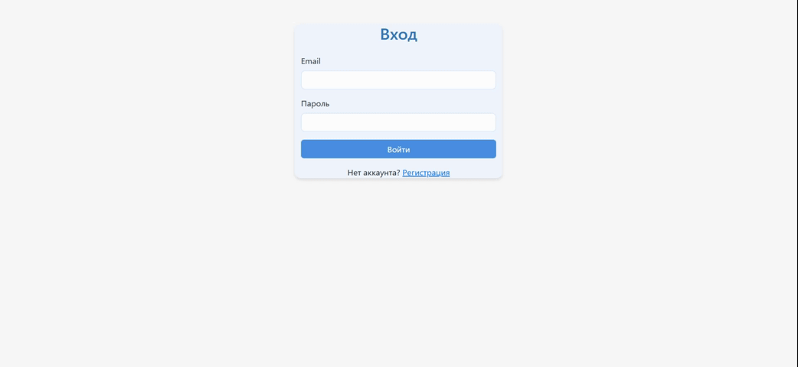
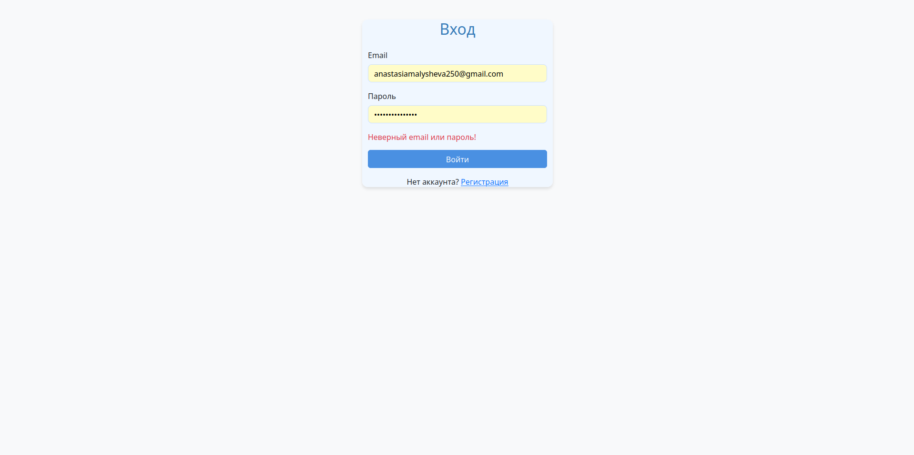
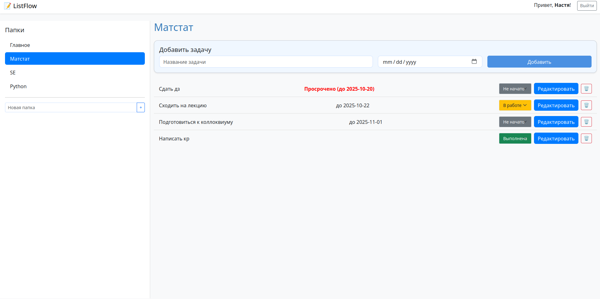

# ListFLow

Web-приложение для управления задачами в списках с возможностью редактирования и установки дедлайна.  
Разработано на Spring Boot с использованием Thymeleaf.

---

## Функционал

- Регистрация и вход пользователей
- Создание задач с возможностью добавления дедлайна
- Редактирование задач
- Изменение статуса задач
- Удаление задач
- Добавление задач в отдельные папки
- Редактирование и удаление папок с задачами

## Демо (GIF)
<p align="center">
  
</p>
<p align="center"><em>Демо: регистрация, создание, редактирование и установка дедлайна для задачи, создание папок</em></p>

## Скриншоты

<p align="center">
  
  <br>
  <em>Авторизация</em>
</p>

<p align="center">
  
  <br>
  <em>Структура списков задач</em>
</p>

---

## Технологии

- Java 21
- Spring Boot 3
- Spring Data JPA
- Thymeleaf
- Gradle
- JUnit + Mockito для тестирования

---

## Установка и запуск

1. Клонируйте репозиторий:

```bash
git clone <URL_репозитория>
cd <имя_папки>
./gradlew bootRun
```
